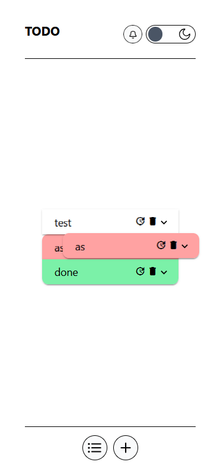
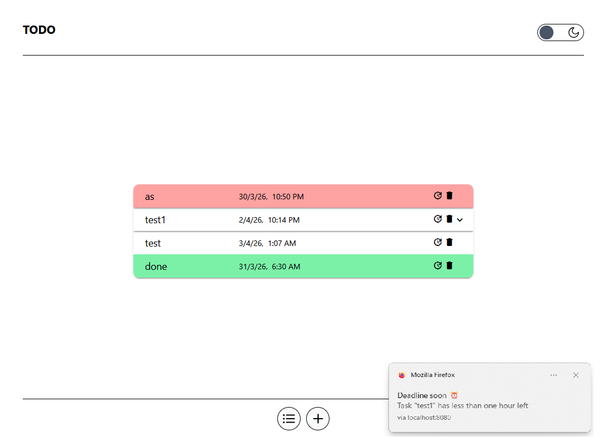
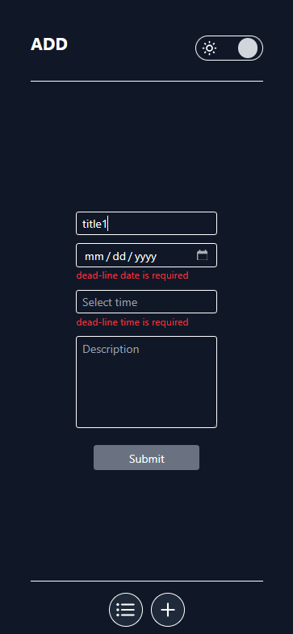
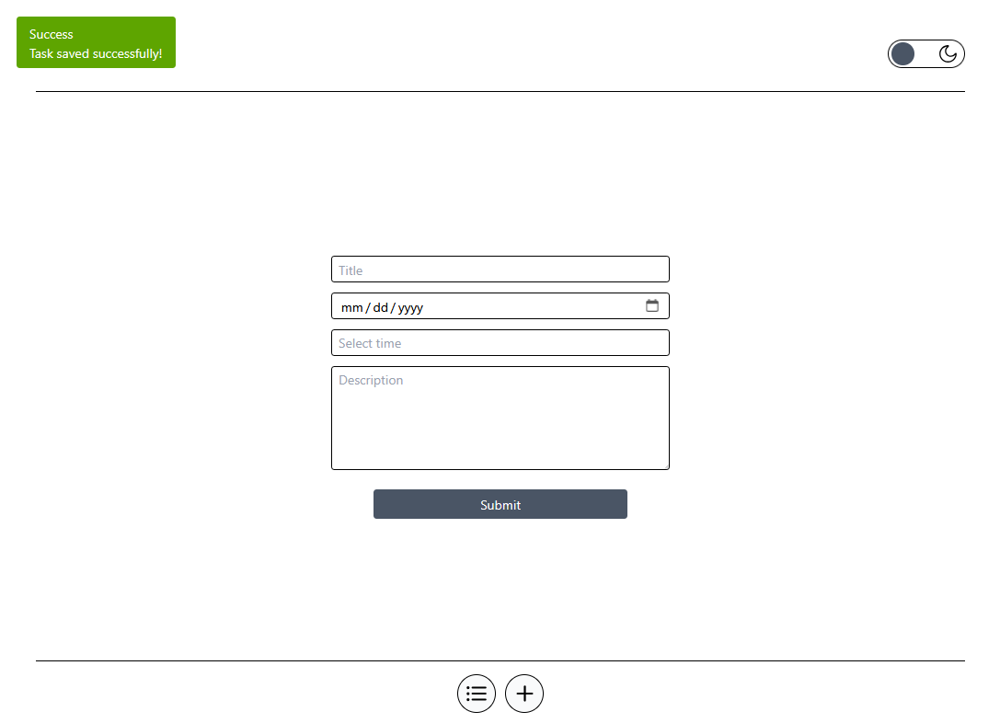

# Todo App with Deadline Notifications

This project is the **first suggested idea** from [Placement Preparation - Angular Project Ideas for Beginners](https://www.placementpreparation.io/blog/angular-project-ideas-for-beginners/). It's a fully functional todo application with deadline tracking and browser notifications.

## Technologies & Tools

- **Angular 20:**  
  Modern framework for building the application with signals and standalone components.

- **Tailwind CSS:**  
  Utility-first CSS framework for rapid UI development.

- **Angular Material:**  
  - **UI Components:**  
    Pre-built components for a polished interface.
  - **Drag & Drop (CDK):**  
    Enables reordering of todo items in the list.

- **Dexie.js:**  
  IndexedDB wrapper for client-side data persistence of todos.

- **Service Worker:**  
  Handles browser notifications for upcoming and overdue task deadlines.

- **RxJS:**  
  Reactive programming for handling asynchronous operations and state management.

- **Lodash:**  
  Utility functions for data manipulation.

- **Toastr:**  
  Toast notifications for user feedback.

- **GitHub Pages:**  
  Deployment platform for the live application.

## Demo

Below is a preview of the application in both mobile and desktop views across the two main pages:

| Todo List - Mobile                | Todo List - Desktop                                      |
|--------------------------------------------------------|----------------------------------------------------------|
|   |   |
| *Mobile view of the todo list page*                   | *Desktop view of the todo list page*                    |

| Add Todo - Mobile                                      | Add Todo - Desktop                                       |
|--------------------------------------------------------|----------------------------------------------------------|
|     |     |
| *Mobile view of the add todo page*                    | *Desktop view of the add todo page*                     |

You can visit the live version at [Todo App](https://still-not-deployed.com/)

TODO: deploy and test readme and live site on github pages